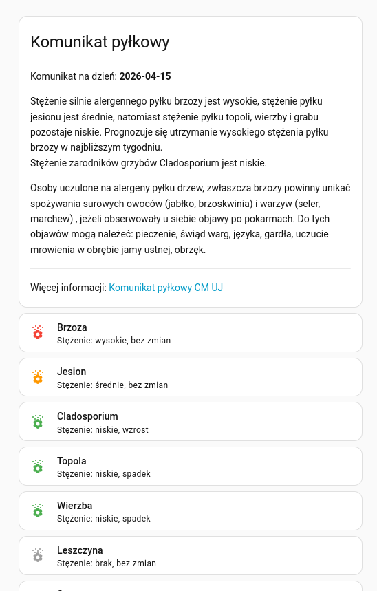

# MQTT Pollen sensor for Home Assistant

Scraper for the
[pollen report by the Jagiellonian University Medical College](https://toksy-alergo.cm-uj.krakow.pl/pl/komunikat-pylkowy-dla-alergikow-malopolska/)
which publishes the parsed pollen report via MQTT for use in Home Assistant.
Supports automatic entity discovery.

## Example dashboard

## LLM use
Google Gemini was used while creating this tool, although most of the codebase itself
is brain-made.